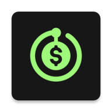

# Subscriptions manager

Offline-first Android application for subscription management and notifications

Tools:
* Kotlin
* Kotlin Coroutines
* Kotlin Flow
* DI: Dagger Hilt
* Room
* Navigation Component
* WorkManager
* Push Notifications
* LiveData
* RecyclerView
* Shared Preferences

System Design patterns and principles: (app architecture diagram [below](#app-architecture-diagram))
* MVVM pattern
* Clean architecture principles
* UseCase pattern
* Repository pattern
* DataSource pattern

 

## Screenshots
(more screenshots [here](/screenshots))

  

  

 

## App architecture diagram 

